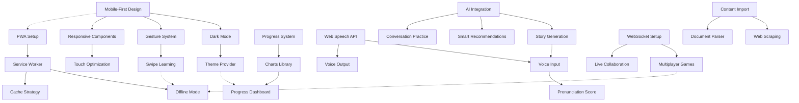

# LangFu 2.0 Technical Architecture & Execution Plan

## System Architecture Overview

```
┌─────────────────────────────────────────────────────────────┐
│                     Client Layer (PWA)                      │
├─────────────────────────────────────────────────────────────┤
│  ┌──────────┐  ┌──────────┐  ┌──────────┐  ┌──────────┐  │
│  │  React   │  │  Next.js │  │   PWA    │  │  Voice   │  │
│  │   UI     │  │  Router  │  │  Service │  │   APIs   │  │
│  │          │  │          │  │  Worker  │  │          │  │
│  └──────────┘  └──────────┘  └──────────┘  └──────────┘  │
├─────────────────────────────────────────────────────────────┤
│                    State Management                         │
│  ┌──────────┐  ┌──────────┐  ┌──────────┐  ┌──────────┐  │
│  │ Zustand  │  │  React   │  │  Local   │  │  IndexDB │  │
│  │  Store   │  │  Query   │  │  Storage │  │  Cache   │  │
│  └──────────┘  └──────────┘  └──────────┘  └──────────┘  │
├─────────────────────────────────────────────────────────────┤
│                     API Layer (Next.js)                     │
│  ┌──────────┐  ┌──────────┐  ┌──────────┐  ┌──────────┐  │
│  │   REST   │  │WebSocket │  │   SSE    │  │  GraphQL │  │
│  │   APIs   │  │  Server  │  │  Events  │  │  (Future)│  │
│  └──────────┘  └──────────┘  └──────────┘  └──────────┘  │
├─────────────────────────────────────────────────────────────┤
│                    Business Logic Layer                     │
│  ┌──────────┐  ┌──────────┐  ┌──────────┐  ┌──────────┐  │
│  │ Learning │  │   Game   │  │   AI     │  │  Social  │  │
│  │  Engine  │  │  Engine  │  │  Engine  │  │  Engine  │  │
│  └──────────┘  └──────────┘  └──────────┘  └──────────┘  │
├─────────────────────────────────────────────────────────────┤
│                      Data Layer                             │
│  ┌──────────┐  ┌──────────┐  ┌──────────┐  ┌──────────┐  │
│  │  Prisma  │  │PostgreSQL│  │  Redis   │  │    S3    │  │
│  │   ORM    │  │    DB    │  │  Cache   │  │  Storage │  │
│  └──────────┘  └──────────┘  └──────────┘  └──────────┘  │
├─────────────────────────────────────────────────────────────┤
│                   External Services                         │
│  ┌──────────┐  ┌──────────┐  ┌──────────┐  ┌──────────┐  │
│  │  OpenAI  │  │ Whisper  │  │ElevenLabs│  │ Firebase │  │
│  │   API    │  │   API    │  │   TTS    │  │Analytics │  │
│  └──────────┘  └──────────┘  └──────────┘  └──────────┘  │
└─────────────────────────────────────────────────────────────┘
```

## Dependency Graph



## Technology Stack & Dependencies

### Current Stack (Keep)

- **Next.js 15**: App router, server components
- **PostgreSQL + Prisma**: Database and ORM
- **Tailwind CSS**: Styling framework
- **Framer Motion**: Animations
- **Zustand**: State management

### New Core Dependencies (P0)

```json
{
  "dependencies": {
    "next-pwa": "^5.6.0", // PWA support
    "next-themes": "^0.3.0", // Dark mode
    "react-swipeable": "^7.0.0", // Swipe gestures
    "recharts": "^2.12.0", // Progress charts
    "@radix-ui/react-*": "^1.0.0", // Accessible components
    "vaul": "^0.9.0" // Mobile drawer
  }
}
```

### Voice & Audio Dependencies (P1)

```json
{
  "dependencies": {
    "react-speech-kit": "^3.0.0", // TTS
    "@speechly/react-client": "^2.0.0", // Speech recognition
    "wavesurfer.js": "^7.0.0", // Audio visualization
    "howler": "^2.2.0" // Audio playback
  }
}
```

### AI & Real-time Dependencies (P1-P2)

```json
{
  "dependencies": {
    "socket.io-client": "^4.0.0", // WebSocket client
    "socket.io": "^4.0.0", // WebSocket server
    "@tanstack/react-query": "^5.0.0", // Data fetching
    "openai": "^4.0.0", // AI integration
    "langchain": "^0.2.0" // AI orchestration
  }
}
```

## Execution Plan - Vertical Slices

### Sprint 1: Mobile Foundation (Week 1)

#### Slice 1.1: Dark Mode + Mobile Layout

**Team**: Frontend Engineer + Designer
**Parallel Tasks**:

1. Implement next-themes provider
2. Create color palette system
3. Update all components with theme variants
4. Add theme toggle component
5. Test across devices

**Deliverable**: Full app works in dark/light mode on mobile

#### Slice 1.2: Gesture System

**Team**: Frontend Engineer
**Parallel Tasks**:

1. Install react-swipeable
2. Create SwipeCard component
3. Implement gesture handlers
4. Add haptic feedback
5. Create tutorial overlay

**Deliverable**: Vocabulary review with swipe gestures

#### Slice 1.3: PWA Setup

**Team**: DevOps Engineer
**Parallel Tasks**:

1. Configure next-pwa
2. Create manifest.json
3. Design app icons
4. Implement service worker
5. Test installation flow

**Deliverable**: Installable PWA on mobile devices

### Sprint 2: Progress & Micro-Learning (Week 2)

#### Slice 2.1: Progress Visualization

**Team**: Frontend + Backend Engineers
**Parallel Tasks**:

1. Design progress schemas
2. Create chart components
3. Build progress API endpoints
4. Implement data aggregation
5. Create progress dashboard

**Deliverable**: Complete progress tracking dashboard

#### Slice 2.2: Micro-Learning Sessions

**Team**: Full-stack Engineer
**Parallel Tasks**:

1. Create quick session mode
2. Build time-based challenges
3. Implement session saving
4. Add notification system
5. Create widget component

**Deliverable**: 30-second learning sessions

### Sprint 3: Story Generation & Voice (Week 3)

#### Slice 3.1: Dynamic Story Generation

**Team**: AI Engineer + Frontend
**Parallel Tasks**:

1. Design story templates
2. Implement AI prompt engineering
3. Create story reader component
4. Build vocabulary filtering
5. Add story saving/continuation

**Deliverable**: AI-generated stories using known vocabulary

#### Slice 3.2: Basic Voice Features

**Team**: Frontend Engineer
**Parallel Tasks**:

1. Implement Web Speech API
2. Create voice button components
3. Add pronunciation practice
4. Build audio controls
5. Test browser compatibility

**Deliverable**: Voice input/output for vocabulary

### Sprint 4: Offline & Optimization (Week 4)

#### Slice 4.1: Offline Mode

**Team**: Full-stack Engineer
**Parallel Tasks**:

1. Implement cache strategies
2. Create sync mechanism
3. Build offline indicators
4. Add conflict resolution
5. Test offline scenarios

**Deliverable**: Full offline learning capability

#### Slice 4.2: Performance Optimization

**Team**: Performance Engineer
**Parallel Tasks**:

1. Implement code splitting
2. Optimize bundle size
3. Add lazy loading
4. Improve rendering performance
5. Set up monitoring

**Deliverable**: <2s load time on 3G

## Parallel Execution Strategy

### Team Allocation

```
Team A: Mobile/Frontend (2 engineers)
- Dark mode implementation
- Gesture system
- Responsive design
- Progress visualization

Team B: PWA/Offline (1 engineer)
- Service worker setup
- Offline caching
- Sync mechanisms
- Installation flow

Team C: AI/Backend (2 engineers)
- Story generation
- Voice API integration
- Learning engine optimization
- API performance

Team D: QA/Testing (1 engineer)
- E2E test suite
- Performance testing
- Cross-browser testing
- Accessibility audit
```

### Parallel Task Matrix

| Week | Team A               | Team B          | Team C           | Team D          |
| ---- | -------------------- | --------------- | ---------------- | --------------- |
| 1    | Dark Mode + Gestures | PWA Setup       | API Optimization | Test Framework  |
| 2    | Progress Dashboard   | Offline Cache   | Story Templates  | Mobile Testing  |
| 3    | Voice UI             | Sync Logic      | AI Integration   | Voice Testing   |
| 4    | Polish & Fix         | Offline Testing | Performance      | Full Regression |

## CI/CD Pipeline

```yaml
name: LangFu CI/CD

on:
  push:
    branches: [main, develop]
  pull_request:
    branches: [main]

jobs:
  test:
    runs-on: ubuntu-latest
    steps:
      - Unit tests
      - Integration tests
      - Lighthouse CI
      - Bundle size check

  deploy:
    needs: test
    steps:
      - Build PWA
      - Deploy to Vercel
      - Run E2E tests
      - Performance monitoring
```

## Risk Mitigation

### Technical Risks

1. **Voice API Browser Support**
   - Mitigation: Progressive enhancement, fallback to text
2. **Offline Sync Conflicts**
   - Mitigation: Last-write-wins + manual resolution UI
3. **PWA iOS Limitations**
   - Mitigation: Native app wrapper as backup plan

4. **AI API Rate Limits**
   - Mitigation: Implement caching, queuing, and fallbacks

### Performance Targets

- Initial Load: <2s on 3G
- Time to Interactive: <3s
- Lighthouse Score: >90
- Bundle Size: <200KB initial

## Monitoring & Analytics

### Key Metrics

- Core Web Vitals (LCP, FID, CLS)
- User engagement (DAU, session length)
- Feature adoption rates
- Error rates and types
- API response times

### Tools

- Vercel Analytics
- Sentry for error tracking
- Custom analytics dashboard
- Real User Monitoring (RUM)

## Security Considerations

### Implementation

- Content Security Policy (CSP)
- HTTPS everywhere
- Secure cookie handling
- Input sanitization
- Rate limiting

### Privacy

- Local-first data storage
- Minimal data collection
- GDPR compliance
- Clear privacy policy

## Success Criteria

### Week 1

- [ ] PWA installable on Android/iOS
- [ ] Dark mode fully functional
- [ ] Swipe gestures working
- [ ] All pages mobile-responsive

### Week 2

- [ ] Progress dashboard live
- [ ] Micro-sessions functional
- [ ] 90+ Lighthouse score

### Week 3

- [ ] Story generation working
- [ ] Voice features in beta
- [ ] Offline mode functional

### Week 4

- [ ] Full feature integration
- [ ] Performance targets met
- [ ] QA sign-off complete
- [ ] Production ready
